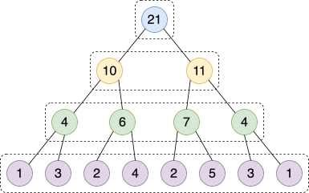
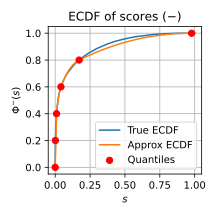
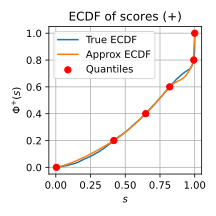
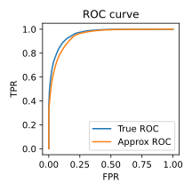
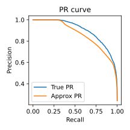
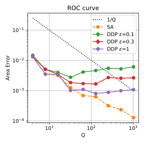
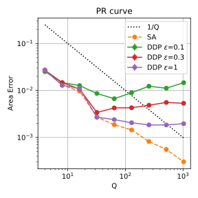

:::{#heading}
:::{.center}

##### $^1$, $^2$

##### $^1$University of Warwick, $^2$University of Oxford

##### Preprint 2025

:::
:::

##### **TL;DR**: 

## Introduction

[Federated Learning](https://en.wikipedia.org/wiki/Federated_learning) allows multiple clients to collaboratively train models without sharing raw data. However, evaluation is often limited to aggregate simple metrics such as accuracy or loss, which provide an incomplete picture of model performance.

We propose a method to approximate [Receiver Operating Characteristic (ROC) and Precision-Recall (PR) curves](/blog/roc-pr-curve.qmd) in federated settings, without accessing raw client data. Our approach supports both [Secure Aggregation](https://eprint.iacr.org/2017/281) and [Differential Privacy](https://en.wikipedia.org/wiki/Differential_privacy), providing provable error guarantees and low communication cost.

## Methods Overview

Our method consists of five main steps:

1. **Local Histograms**: Clients build histograms for positive/negative scores.
2. **Aggregation**: The server collects and combines histograms.
3. **Quantile Estimation**: Quantiles are estimated from bin counts.
4. **ECDF Approximation**: Interpolate quantiles to reconstruct ECDFs.
5. **Curve Construction**: Use ECDFs to compute ROC and PR curves.

### Quantiles Estimation via Histograms

To estimate quantiles, each client builds a hierarchical histogram (@fig-hist) by recursively dividing the score range into equal-width bins and counting examples in each. The server aggregates these histograms and computes global quantiles based on the combined bin counts and boundaries.

::: {#fig-hist}

Hierarchical histogram structure.
:::

To ensure client's privacy, we consider two mechanisms:

- Secure Aggregation: The server sees only the total, not individual bins from clients.
- Differential Privacy: Clients add independent noise to each bin before sending.

### Curve Approximation via Quantiles

Let $\Phi^-(s)$ and $\Phi^+(s)$ be the ECDFs of prediction score distributions for negative and positive examples. We estimate $Q$ evenly spaced quantiles ($Q=6$ in @fig-ecdf), and apply [monotone piecewise cubic polynomial interpolation (PCHIP)](/blog/pchip.qmd) to approximate the full ECDFs.

::: {#fig-ecdf layout-ncol=2}
{fig-align="center"}

{fig-align="center"}

ECDFs reconstructed from $Q$ quantiles for both classes.
:::

For the ROC curve, we then compute:

$$
T(s)=1-\Phi^+(s),
$$ {#eq-tpr}

$$
F(s)=1-\Phi^-(s),
$$ {#eq-fpr}

where $T(s)$ and $F(s)$ denote the true positive rate (TPR) and false positive rate (FPR).

For the PR curve, recall is equivalent to TPR, and precision is computed by:

$$
P(s)=\frac{T(s)n^+}{T(s)n^+ + F(s)n^-}
$$ {#eq-precision}

Here, $n^+$ and $n^-$ are the number of positive and negative examples. @fig-curve shows the resulting approximated ROC and PR curves.

::: {#fig-curve layout-ncol=2}
{fig-align="center"}

{fig-align="center"}

ROC and PR curves approximated from ECDFs.
:::

## Theoretical Guarantees

To quantify approximation quality, we define the **Area Error (AE)** as:

::: {#def-area-error}

AE is the integral of the absolute difference between the true and estimated curves:
$$
\text{AE}_\text{ROC} = \int_0^1 |T(f) - \hat{T}(f)| df,
$$ {#eq-area-error-roc}

$$
\text{AE}_\text{PR} = \int_0^1 |P(t) - \hat{P}(t)| dt,
$$ {#eq-area-error-pr}

where $T(f) = T(F^{-1}(f))$ and $P(t) = \frac{tn^+}{tn^+ + F(T^{-1}(t))n^-}$ are the true ROC and PR curves, and $\hat{T}(f) = \hat{T}(\hat{F}^{-1}(f))$ and $\hat{P}(t) = \frac{tn^+}{tn^+ + \hat{F}(\hat{T}^{-1}(t))n^-}$ are their estimates.

:::

Assuming Lipschitz continuity of score distributions $\Phi^-(s)$ and $\Phi^+(s)$, we bound the AE as follows:

::: {#thm-area-error-sa}

Let $Q$ be the number of quantiles used. Then:

- Under Secure Aggregation: $\text{AE}_\text{ROC}\le O(1/Q)$ and $\text{AE}_\text{PR}\le\tilde{O}(1/Q)$.
- Under $\varepsilon$-Differential Privacy: $\text{AE}\le\tilde{O}\left(\frac{1}{Q} + \frac{1}{n\varepsilon}\right)$, where $n$ is the number of examples.
:::

## Empirical Evaluation

We evaluate our method on the [Adult dataset](https://archive.ics.uci.edu/dataset/2/adult) using an [XGBoost classifier](https://xgboost.readthedocs.io/), as shown in @fig-error. We vary the number of quantiles $Q\in\{4,8,\dots,1024\}$ and test both Secure Aggregation (SA) and Distributed Differential Privacy (DDP) with privacy budgets $\varepsilon\in\{0.1,0.3,1\}$.

::: {#fig-error layout-ncol=2}
{fig-align="center"}

{fig-align="center"}

Area Error of ROC and PR curves vs. number of quantiles.
:::

Key observations are as follows:

1. Area Error decreases with more quantiles $Q$.
2. PR curve incurs slightly higher error than ROC curve.
3. With DP, error plateaus and grows as $\varepsilon$ decreases (stronger privacy).
