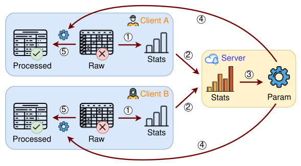
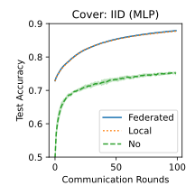
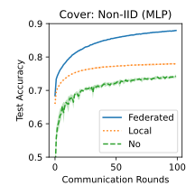

:::{#heading}
:::{.center}

##### $^1$ and $^2$

##### $^1$University of Warwick, $^2$University of Oxford

##### Preprint 2026

:::
:::

##### **TL;DR**: 

## Why Federated Preprocessing?

[Data preprocessing](https://en.wikipedia.org/wiki/Data_preprocessing) is a crucial step in machine learning pipelines, transforming raw data into a suitable format for model training. However, in [federated learning](https://en.wikipedia.org/wiki/Federated_learning), this step is often overlooked.

We introduce **FedPS**, a federated data preprocessing framework that uses aggregated summary statistics from clients to perform core preprocessing tasks, including scaling, encoding, transformation, discretization, and missing-value imputation, while keeping raw data decentralized.

## Preprocessing Tasks

- **Scaling**: Normalize features to comparable ranges.
- **Encoding**: Convert categorical values into numerical form.
- **Transformation**: Apply non-linear mappings (distribution adjustments).
- **Discretization**: Convert continuous values into discrete form.
- **Imputation**: Fill in missing values (univariate or multivariate).

## How FedPS Works?

The FedPS framework operates in five steps (@fig-overview):

::: {.steps}
- <span class="circled">1</span> Compute local statistics; 
- <span class="circled">2</span> Share and aggregate statistics; 
- <span class="circled">3</span> Derive preprocessing parameters; 
- <span class="circled">4</span> Broadcast parameters to clients; 
- <span class="circled">5</span> Apply preprocessing locally.
:::

::: {#fig-overview}


Overview of FedPS preprocessing framework.
:::

For example, to implement [*StandardScaler*](https://scikit-learn.org/stable/modules/generated/sklearn.preprocessing.StandardScaler.html), which ensures features have zero mean and unit variance:

::: {.steps}
- <span class="circled">1</span> Clients computes statistics $(n, c, s)$, where $n$ is number of samples, $c=\sum_i x_i$ and $s=\sum_i x_i^2$.
- <span class="circled">2</span> Server aggregates these statistics by summation to obtain $(N, C, S)$.
- <span class="circled">3</span> Server computes the global mean and variance: $\mu=C/N$, $\sigma^2=S/N-\mu^2$.
- <span class="circled">4</span> The server broadcasts $(\mu, \sigma)$ to all clients.
- <span class="circled">5</span> Clients apply feature scaling on local data: $x'=(x-\mu)/\sigma$.
:::

## What Statistics Are Needed?

We examine the summary statistics required by common preprocessors in [Scikit-learn](https://scikit-learn.org/stable/modules/preprocessing.html). @tbl-statistics highlights representative preprocessors and their formulations. The complete table and communication analysis appear in the paper.

+----------------+---------------------------------------------------------------------------------------------------------------------------+------------------------------------+----------------------------+
| Categories     | Preprocessors                                                                                                             | Formulation                        | Statistics                 |
+:==============:+:=========================================================================================================================:+:==================================:+:==========================:+
|                | [*MinMaxScaler*](https://scikit-learn.org/stable/modules/generated/sklearn.preprocessing.MinMaxScaler.html)               | $(x-x_{\max})/(x_{\max}-x_{\min})$ | Min, Max                   |
|                +---------------------------------------------------------------------------------------------------------------------------+------------------------------------+----------------------------+
| Scaling        | [*StandardScaler*](https://scikit-learn.org/stable/modules/generated/sklearn.preprocessing.StandardScaler.html)           | $(x-\mu)/\sigma$                   | Mean, Variance             |
|                +---------------------------------------------------------------------------------------------------------------------------+------------------------------------+----------------------------+
|                | [*RobustScaler*](https://scikit-learn.org/stable/modules/generated/sklearn.preprocessing.RobustScaler.html)               | $(x-Q_2)/(Q_3-Q_1)$                | Quantile                   |
+----------------+---------------------------------------------------------------------------------------------------------------------------+------------------------------------+----------------------------+
|                | [*LabelEncoder*](https://scikit-learn.org/stable/modules/generated/sklearn.preprocessing.LabelEncoder.html)               | ordinal($y$)                       | Set Union                  |
|                +---------------------------------------------------------------------------------------------------------------------------+------------------------------------+----------------------------+
| Encoding       | [*OneHotEncoder*](https://scikit-learn.org/stable/modules/generated/sklearn.preprocessing.OneHotEncoder.html)             | one-hot($x$)                       | Set Union, Frequent items  |
|                +---------------------------------------------------------------------------------------------------------------------------+------------------------------------+----------------------------+
|                | [*OrdinalEncoder*](https://scikit-learn.org/stable/modules/generated/sklearn.preprocessing.OrdinalEncoder.html)           | ordinal($x$)                       | Set Union, Frequent items  |
+----------------+---------------------------------------------------------------------------------------------------------------------------+------------------------------------+----------------------------+
|                | [*PowerTransformer*](https://scikit-learn.org/stable/modules/generated/sklearn.preprocessing.PowerTransformer.html)       | $\psi(\lambda,x)$                  | Sum, Mean, Variance        |
| Transformation +---------------------------------------------------------------------------------------------------------------------------+------------------------------------+----------------------------+
|                | [*QuantileTransformer*](https://scikit-learn.org/stable/modules/generated/sklearn.preprocessing.QuantileTransformer.html) | CDF($x$), $\Phi^{-1}$(CDF($x$))    | Quantile                   |
+----------------+---------------------------------------------------------------------------------------------------------------------------+------------------------------------+----------------------------+
| Discretization | [*KBinsDiscretizer*](https://scikit-learn.org/stable/modules/generated/sklearn.preprocessing.KBinsDiscretizer.html)       | $j$ if $T_j\le x<T_{j+1}$          | Min, Max, Quantile, Mean   |
+----------------+---------------------------------------------------------------------------------------------------------------------------+------------------------------------+----------------------------+
|                | [*SimpleImputer*](https://scikit-learn.org/stable/modules/generated/sklearn.impute.SimpleImputer.html)                    | mean($x$), median($x$), freq($x$)  | Mean, Quantile, Freq-items |
|                +---------------------------------------------------------------------------------------------------------------------------+------------------------------------+----------------------------+
| Imputation     | [*KNNImputer*](https://scikit-learn.org/stable/modules/generated/sklearn.impute.KNNImputer.html)                          | mean($k$-NN of $x$)                | Min, Mean, Sum             |
|                +---------------------------------------------------------------------------------------------------------------------------+------------------------------------+----------------------------+
|                | [*IterativeImputer*](https://scikit-learn.org/stable/modules/generated/sklearn.impute.IterativeImputer.html)              | RegressionModel($x$)               | Sum                        |
+----------------+---------------------------------------------------------------------------------------------------------------------------+------------------------------------+----------------------------+

: Preprocessors and associated statistics. {#tbl-statistics .striped .hover}

Basic statistics, Min, Max, Mean, Variance, are inexpensive to compute in a federated setting. In contrast, statistics like quantiles and frequent items require substantial communication if computed exactly. For these, we use [data sketching](https://datasketches.apache.org/) techniques (quantile sketches, frequent-items sketches) to compute them.

Some preprocessors rely on machine learning models, for example:

- [*KBinsDiscretizer*](https://scikit-learn.org/stable/modules/generated/sklearn.preprocessing.KBinsDiscretizer.html) uses [$k$-means clustering](https://en.wikipedia.org/wiki/K-means_clustering).
- [*KNNImputer*](https://scikit-learn.org/stable/modules/generated/sklearn.impute.KNNImputer.html) uses [$k$-nearest neighbors](https://en.wikipedia.org/wiki/K-nearest_neighbors_algorithm).
- [*IterativeImputer*](https://scikit-learn.org/stable/modules/generated/sklearn.impute.IterativeImputer.html) uses [Bayesian linear regression](https://en.wikipedia.org/wiki/Bayesian_linear_regression).

We extend these algorithms to the federated setting, with sufficient statistics summarized in @tbl-statistics.

## Why Not Other Approaches?

Several preprocessing approaches are possible in federated learning:

1. **Centralized preprocessing**: upload all data to the server.
2. **No preprocessing**: skip preprocessing entirely.
3. **Transfer preprocessing**: use public data or pre-trained models.
4. **Local preprocessing**: each client processes data independently.
5. **Federated preprocessing**: our proposed FedPS framework.

All alternatives except federated preprocessing have major limitations (@tbl-approaches).

+-------------------------------+------------------------------------------------+
| Approaches                    | Key Summary                                    |
+:==============================+:===============================================+
| 1. Centralized preprocessing  | - Pros: Consistent across clients              |
|                               | - Cons: Infeasible in real setting             |
+-------------------------------+------------------------------------------------+
| 2. No preprocessing           | - Cons: Data issues remain                     |
|                               | - Cons: Poor model performance                 |
+-------------------------------+------------------------------------------------+
| 3. Transfer preprocessing     | - Pros: Works for easy tasks                   |
|                               | - Cons: Fails on complex tasks                 |
+-------------------------------+------------------------------------------------+
| 4. Local preprocessing        | - Pros: Easy to implement and deploy           |
|                               | - Cons: Inconsistent transforms across clients |
+-------------------------------+------------------------------------------------+
| 5. Federated preprocessing    | - Pros: Consistent global preprocessing        |
|                               | - Pros: Better model performance               |
+-------------------------------+------------------------------------------------+

: Approaches for data preprocessing in federated learning. {#tbl-approaches .striped .hover}

## Experiments

We evaluate [*StandardScaler*](https://scikit-learn.org/stable/modules/generated/sklearn.preprocessing.StandardScaler.html) and [*OrdinalEncoder*](https://scikit-learn.org/stable/modules/generated/sklearn.preprocessing.OrdinalEncoder.html) using three preprocessing strategies, federated preprocessing, local preprocessing, and no preprocessing, on the [Cover dataset](https://archive.ics.uci.edu/dataset/31/covertype). We train using the [FedAvg](https://arxiv.org/abs/1602.05629) algorithm and an [MLP model](https://en.wikipedia.org/wiki/Multilayer_perceptron). Test accuracy results are shown in @fig-accuracy.

We consider two types of client data distributions:

- **IID setting**: data is uniformly partitioned across clients.
- **Non-IID setting**: data is partitioned with skewed label distributions.

::: {#fig-accuracy layout-ncol=2}
{fig-align="center"}

{fig-align="center"}

Test accuracy comparison under IID (left) and non-IID (right) settings.
:::

The results highlight three key observations:

1. Preprocessing is essential, i.e, large accuracy gap vs. no preprocessing.
2. Local preprocessing fails in non-IID settings due to inconsistent transforms.
3. Federated preprocessing achieves stable and superior performance in all scenarios.

## Citation

```bibtex
@misc{Xu2026fedps,
  title={FedPS: Federated data Preprocessing via aggregated Statistics},
  author={Xuefeng Xu and Graham Cormode},
  year={2026},
  eprint={2602.10870},
  archivePrefix={arXiv},
  primaryClass={cs.LG},
  url={https://arxiv.org/abs/2602.10870},
}
```
