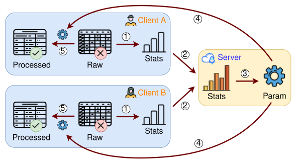
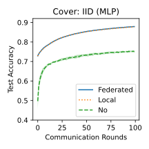
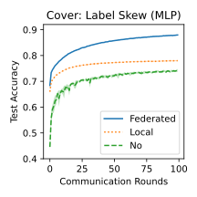
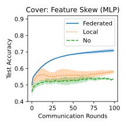

:::{#heading}
:::{.center}

##### $^1$, $^2$

##### $^1$University of Warwick, $^2$University of Oxford

##### TMLR 2026

:::
:::

##### **TL;DR**: 

## Why Federated Preprocessing?

[Data preprocessing](https://en.wikipedia.org/wiki/Data_preprocessing) is a crucial step in machine learning pipelines, transforming raw data into a suitable format for model training. However, in [federated learning (FL)](https://en.wikipedia.org/wiki/Federated_learning), where data is distributed across multiple clients, the vast majority of research has focused on model training, often neglecting the critical preprocessing phase.

We introduce **FedPS**, a federated data preprocessing framework that uses aggregated summary statistics from clients to perform core preprocessing tasks, allowing clients to apply consistent transformations without centralizing raw data.

## Preprocessing Strategies in FL

Several preprocessing strategies are possible in federated learning:

1. **Centralized preprocessing**: Upload all data to the server.
2. **No preprocessing**: Skip preprocessing entirely.
3. **Transfer preprocessing**: Use public data or pre-trained models.
4. **Local preprocessing**: Each client processes its data independently.
5. **Federated preprocessing**: Use our proposed FedPS framework.

All alternatives except federated preprocessing have major limitations (@tbl-strategies).

+-------------------------------+------------------------------------------------+
| Strategies                    | Key Summary                                    |
+:==============================+:===============================================+
| 1. Centralized preprocessing  | - Pros: Consistent across clients              |
|                               | - Cons: Infeasible in real-world settings      |
+-------------------------------+------------------------------------------------+
| 2. No preprocessing           | - Cons: Data quality issues remain             |
|                               | - Cons: Poor model performance                 |
+-------------------------------+------------------------------------------------+
| 3. Transfer preprocessing     | - Pros: Effective for simple tasks             |
|                               | - Cons: May fail in complex tasks              |
+-------------------------------+------------------------------------------------+
| 4. Local preprocessing        | - Pros: Easy to implement and deploy           |
|                               | - Cons: Inconsistent transforms across clients |
+-------------------------------+------------------------------------------------+
| 5. Federated preprocessing    | - Pros: Consistent global preprocessing        |
|                               | - Pros: Better model performance               |
+-------------------------------+------------------------------------------------+

: Strategies for data preprocessing in federated learning. {#tbl-strategies .striped .hover}

## How Does FedPS Work?

The FedPS framework operates in five steps (@fig-overview):

::: {.steps}
- 1 Compute local statistics; 
- 2 Share and aggregate statistics; 
- 3 Derive preprocessing parameters; 
- 4 Broadcast parameters to clients; 
- 5 Apply preprocessing locally.
:::

::: {#fig-overview}

Overview of federated data preprocessing in FedPS.
:::

## Case Studies

**Example 1**: Implementing , which ensures features have zero mean and unit variance.

::: {.steps}
- 1 Clients compute statistics $(n, c=\sum_i x_i, s=\sum_i x_i^2)$, where $n$ is number of samples.
- 2 Server aggregates these statistics by summation: $(N=\sum n, C=\sum c, S=\sum s)$.
- 3 Server computes the global mean and variance: $\mu=C/N$, $\sigma^2=S/N-\mu^2$.
- 4 Server broadcasts parameters $(\mu, \sigma)$ to all clients.
- 5 Clients scale the feature as $x'=(x-\mu)/\sigma$.
:::

**Example 2**: Implementing  (quantile), which discretizes continuous features into $k$ bins based on quantiles and ensures that each bin has  the same number of samples.

::: {.steps}
- 1 Clients construct local quantile sketches.
- 2 Server merges sketches to estimate global quantiles.
- 3 Global quantiles are obtained as bin thresholds.
- 4 Server broadcasts thresholds $(T_0, T_1, ..., T_k)$ to all clients.
- 5 Clients assign $x$ to bin $j$ if $T_j \le x < T_{j+1}$.
:::

## What Statistics Are Needed?

We categorize preprocessing tasks into five types:

- **Scaling**: Normalize features to comparable ranges.
- **Encoding**: Convert categorical values into numerical form.
- **Transformation**: Apply non-linear mappings (distribution adjustments).
- **Discretization**: Convert continuous values into discrete form.
- **Imputation**: Fill in missing values (univariate or multivariate).

We then examine the summary statistics required by preprocessors in [Scikit-learn](https://scikit-learn.org/). @tbl-statistics highlights representative preprocessors and their formulations.

::: {#tbl-statistics .list-table .striped .hover aligns="c,c,c,c"}
Preprocessors and associated statistics.

- - Categories
  - Preprocessors
  - Formulation
  - Statistics

- - Scaling
  - 

    

    
  - $(x-x_{\min})/(x_{\max}-x_{\min})$

    $(x-\mu)/\sigma$

    $(x-Q_2)/(Q_3-Q_1)$
  - Min, Max

    Mean, Variance

    *Quantile*

- - Encoding
  - 

    

    
  - ordinal($y$)

    one-hot($x$)

    ordinal($x$)
  - Set Union

    Set Union, *Frequent items*

    Set Union, *Frequent items*

- - Transformation
  - 

    
  - $\psi(\lambda,x)$

    CDF($x$), $\Phi^{-1}$(CDF($x$))
  - Sum, Mean, Variance

    *Quantile*

- - Discretization
  - 
  - $j$ if $T_j\le x<T_{j+1}$
  - Min, Max, *Quantile*, Mean

- - Imputation
  - 

    

    
  - mean($x$), median($x$), freq($x$)

    mean($k$-NN of $x$)

    RegressionModel($x$)
  - Mean, *Quantile*, *Frequent items*

    Min, Mean, Sum

    Sum
:::

Basic statistics, Min, Max, Mean, Variance, are inexpensive to compute in a federated setting. In contrast, statistics like quantiles and frequent items require substantial communication if computed exactly. For these, we use [data sketching](https://datasketches.apache.org/) techniques (quantile sketches, frequent-items sketches) to compute them.

Some preprocessors rely on machine learning models, for example:

-  (kmeans) uses [$k$-means clustering](https://en.wikipedia.org/wiki/K-means_clustering).
-  uses [$k$-nearest neighbors](https://en.wikipedia.org/wiki/K-nearest_neighbors_algorithm).
-  uses [Bayesian linear regression](https://en.wikipedia.org/wiki/Bayesian_linear_regression).

We extend these algorithms to the federated setting, with sufficient statistics summarized in @tbl-statistics.

## Empirical Evaluations

We evaluate  using federated, local, and no preprocessing strategies on the [Cover dataset](https://archive.ics.uci.edu/dataset/31/covertype). We train using the [FedAvg](https://arxiv.org/abs/1602.05629) algorithm and an [MLP model](https://en.wikipedia.org/wiki/Multilayer_perceptron). Test accuracy results are shown in @fig-accuracy. We consider both IID and non-IID settings:

- **IID setting**: data is uniformly at random partitioned across clients.
- **Non-IID setting**: data is partitioned with skewed label and feature distributions.

::: {#fig-accuracy layout-ncol=3}
{fig-align="center"}

{fig-align="center"}

{fig-align="center"}

Test accuracy comparison under IID, label skew, and feature skew settings.
:::

The results highlight three key observations:

1. Preprocessing substantially improves accuracy compared with no preprocessing.
2. Local preprocessing performs poorly in non-IID settings due to inconsistent transforms.
3. Federated preprocessing achieves the most stable and highest performance.

##### *[Takeaway: Federated learning pipelines should incorporate data preprocessing as well as model training.]{.mark}*
