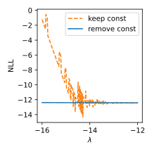
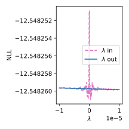
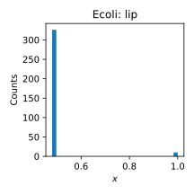
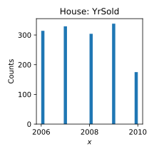
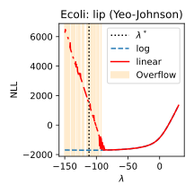
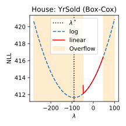
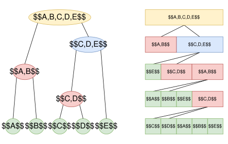
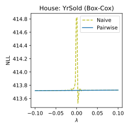
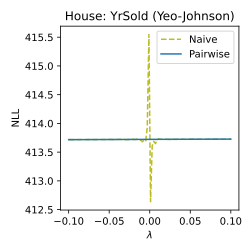

:::{#heading}
:::{.center}

##### $^1$, $^2$

##### $^1$University of Warwick, $^2$University of Oxford

##### [AISTATS 2026](https://virtual.aistats.org/virtual/2026/poster/13885)

:::
:::

##### **TL;DR**: 

## Introduction

[Power transforms](https://en.wikipedia.org/wiki/Power_transform) are widely used parametric methods in statistics and machine learning to make data more Gaussian-like. However, standard implementations suffer from numerical instabilities that can cause incorrect parameter estimates or even runtime failures.

We provide a systematic analysis of these issues and propose effective remedies. We further extend our approach to the [federated learning](https://en.wikipedia.org/wiki/Federated_learning) setting, tackling both numerical stability and distributed computation. Finally, we validate our methods on real-world datasets.

## Challenge 1: Catastrophic Cancellation

Two common transforms are [Box–Cox](https://en.wikipedia.org/wiki/Power_transform#Box–Cox_transformation) and [Yeo–Johnson](https://en.wikipedia.org/wiki/Power_transform#Yeo–Johnson_transformation). For Box–Cox, with parameter $\lambda$, the transform is:

$$
\psi(\lambda, x) =
\begin{cases}
\frac{x^\lambda-1}{\lambda} & \text{if } \lambda\neq0,\\
\ln x & \text{if } \lambda=0.
\end{cases}
$$ {#eq-psi}

Given data $X = \{x_1,\dots,x_n\}$, the optimal $\lambda^*$ minimizes the negative log-likelihood (NLL):

$$
\text{NLL} = (1-\lambda) \sum_{i=1}^n \ln x_i
+ \frac{n}{2} \ln \text{Var}[\psi(\lambda, x)].
$$ {#eq-nll}

The variance term is especially prone to cancellation. Consider three mathematically equivalent forms:

1. Keep the constant term:
$$
\ln \text{Var}[\psi(\lambda, x)] = \ln \text{Var}[(x^\lambda - 1) / \lambda]
$$ {#eq-var-keepconst}
2. Remove the constant term:
$$
\ln \text{Var}[\psi(\lambda, x)] = \ln \text{Var}(x^\lambda / \lambda)
$$ {#eq-var-removeconst}
3. Factor out $\lambda$:
$$
\ln \text{Var}[\psi(\lambda, x)] = \ln \text{Var}(x^\lambda) - 2\ln |\lambda|
$$ {#eq-var-lmbdaout}

As shown in @fig-nll-formula, different forms yield very different numerical behavior. Removing the constant term and factoring out $\lambda$ produces smooth NLL curves, while the other forms lead to spikes and discontinuities.

::: {#fig-nll-formula layout-ncol=2}
{fig-align="center"}

{fig-align="center"}

NLL computed under different variance formulas.
:::

##### *[Takeaway 1]{.mark} -- Equivalent formulas can behave differently, careful analysis is essential.*

## Challenge 2: Numerical Overflow

Variance terms are also prone to overflow. We construct adversarial datasets that trigger overflow across floating-point precisions ([IEEE 754](https://en.wikipedia.org/wiki/IEEE_754)) for Box-Cox in @tbl-advdata.

+----------+---------------------------+-------------+-------+-----------------------------+------------------------+
| Overflow | Adversarial Data          | $\lambda^*$ | NLL   | Extreme $\psi(\lambda^*,x)$ | Max Value (Precision)  |
+:========:+:=========================:+:===========:+:=====:+:===========================:+:======================:+
| Negative | [0.1, 0.1, 0.1, 0.109]    | -41.70      | 23.91 | -1.20e+40                   |                        |
+----------+---------------------------+-------------+-------+-----------------------------+ 3.40e+38 (Single)      |
| Positive | [10, 10, 10, 9.2]         | 43.10       | 5.79  | 2.90e+41                    |                        |
+----------+---------------------------+-------------+-------+-----------------------------+------------------------+
| Negative | [0.1, 0.1, 0.1, 0.101]    | -361.15     | 32.62 | -3.87e+358                  |                        |
+----------+---------------------------+-------------+-------+-----------------------------+ 1.80e+308 (Double)     |
| Positive | [10, 10, 10, 9.9]         | 357.55      | 14.18 | 9.96e+354                   |                        |
+----------+---------------------------+-------------+-------+-----------------------------+------------------------+
| Negative | [0.1, 0.1, 0.1, 0.10001]  | -35936.9    | 51.03 | -2.30e+35932                |                        |
+----------+---------------------------+-------------+-------+-----------------------------+ 1.19e+4932 (Quadruple) |
| Positive | [10, 10, 10, 9.999]       | 35933.3     | 32.61 | 5.85e+35928                 |                        |
+----------+---------------------------+-------------+-------+-----------------------------+------------------------+
| Negative | [0.1, 0.1, 0.1, 0.100001] | -359353.0   | 60.24 | -2.74e+359347               |                        |
+----------+---------------------------+-------------+-------+-----------------------------+ 1.61e+78913 (Octuple)  |
| Positive | [10, 10, 10, 9.9999]      | 359349.0    | 41.82 | 6.99e+359343                |                        |
+----------+---------------------------+-------------+-------+-----------------------------+------------------------+

: Adversarial datasets inducing overflow {#tbl-advdata .striped .hover}

Such issues also appear in real-world dataset. @fig-hist shows the histograms of skewed and  large-value features in the [Ecoli](https://archive.ics.uci.edu/dataset/39/ecoli) and [House](https://www.kaggle.com/competitions/house-prices-advanced-regression-techniques/data) datasets.

::: {#fig-hist layout-ncol=2}
{fig-align="center"}

{fig-align="center"}

Histograms of skewed and large-valued features.
:::

To avoid overflow, we use [log-domain computation](/blog/power-transform.qmd#log-domain-computation) for the variance. @fig-nll-log-linear compares NLL curves: linear-domain breaks down, while log-domain remains continuous and stable.

::: {#fig-nll-log-linear layout-ncol=2}
{fig-align="center"}

{fig-align="center"}

NLL computed in log-domain vs. linear-domain.
:::

##### *[Takeaway 2]{.mark} -- Use log-domain computation when handling extreme values.*

## Challenge 3: Federated Aggregation

In federated learning, we want to estimate a global $\lambda^*$ across distributed clients. This requires stable computation of global NLL under communication constraints.

A naive one-pass method has clients send $(n, \sum_i x_i, \sum_i x_i^2)$, and the server sums each component. The variance is then computed as:

$$
\frac{1}{n} \sum_{i=1}^n x_i^2 - \frac{1}{n^2} \left(\sum_{i=1}^n x_i\right)^2
$$ {#eq-var-naive}

[The @eq-var-naive is unstable](/blog/variance.qmd#numerical-cancellation). Instead, we adopt the pairwise algorithm: clients send $(n, \bar{x}, s)$ with mean $\bar{x}$ and sum of squared deviations $s=\sum_i(x_i-\bar{x})^2$. The server merges them in a tree structure (@fig-tree-queue):

::: {#fig-tree-queue}

Tree-style pairwise aggregation.
:::

The merging formulas are as follows and the final variance is $s/n$:

$$
\begin{align*}
n^{(AB)} &= n^{(A)} + n^{(B)},\\
\bar{x}^{(AB)} &= \bar{x}^{(A)} + (\bar{x}^{(B)} - \bar{x}^{(A)}) \cdot \frac{n^{(B)}}{n^{(AB)}},\\
s^{(AB)} &= s^{(A)} + s^{(B)} +(\bar{x}^{(B)} - \bar{x}^{(A)})^2 \cdot \frac{n^{(A)}n^{(B)}}{n^{(AB)}}.
\end{align*}
$$ {#eq-var-pairwise}

@fig-fednll-pairwise shows that naive formulas produce spiky curves, while pairwise aggregation yields smooth ones.

::: {#fig-fednll-pairwise layout-ncol=2}
{fig-align="center"}

{fig-align="center"}

NLL in federated setting: naive vs. pairwise.
:::

##### *[Takeaway 3]{.mark} -- Avoid textbook one-pass variance formula in numerical computing.*

## Open Source Contributions

Our methods have been integrated into [SciPy](https://scipy.org/) and [Scikit-learn](https://scikit-learn.org/):

- [scipy.stats.boxcox_normmax](https://docs.scipy.org/doc/scipy/reference/generated/scipy.stats.boxcox_normmax.html)
- [scipy.stats.boxcox_llf](https://docs.scipy.org/doc/scipy/reference/generated/scipy.stats.boxcox_llf.html) and [scipy.stats.yeojohnson_llf](https://docs.scipy.org/doc/scipy/reference/generated/scipy.stats.yeojohnson_llf.html)
- [scipy.special.boxcox](https://docs.scipy.org/doc/scipy/reference/generated/scipy.special.boxcox.html) and [scipy.special.boxcox1p](https://docs.scipy.org/doc/scipy/reference/generated/scipy.special.boxcox1p.html)
- [scipy.special.inv_boxcox](https://docs.scipy.org/doc/scipy/reference/generated/scipy.special.inv_boxcox.html) and [scipy.special.inv_boxcox1p](https://docs.scipy.org/doc/scipy/reference/generated/scipy.special.inv_boxcox1p.html)
- [sklearn.preprocessing.PowerTransformer](https://scikit-learn.org/stable/modules/generated/sklearn.preprocessing.PowerTransformer.html)
